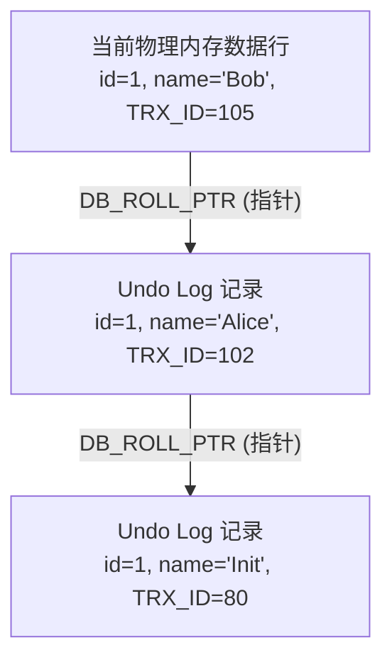
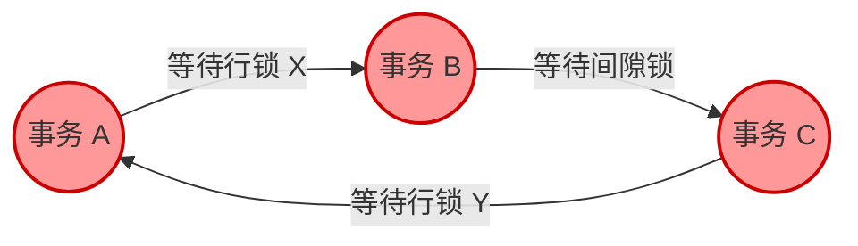
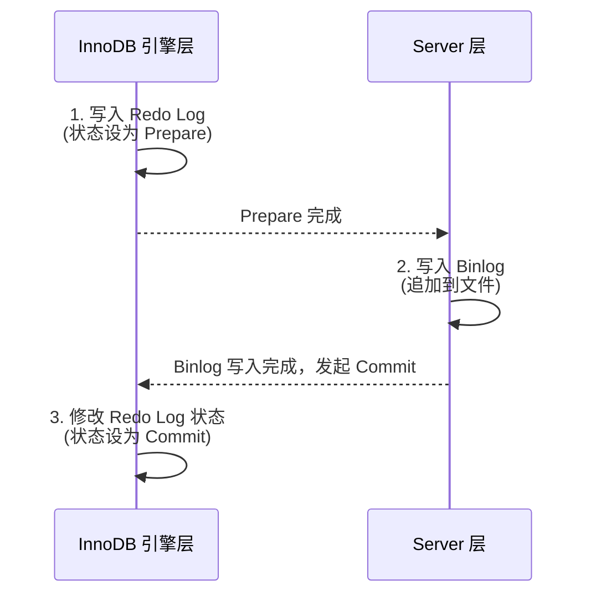
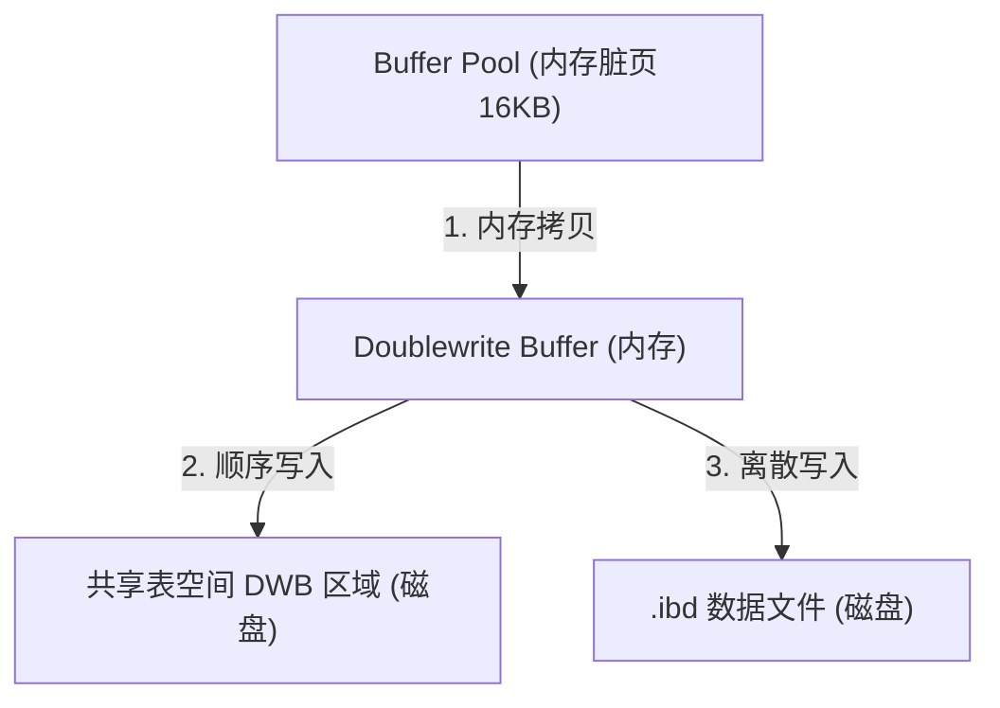
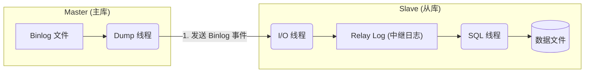

# MySQL 面试核心知识框架

> **核心主线**：定位(OLTP) → 存储(B+Tree/Page) → 内存(Buffer Pool) → 并发(MVCC+Lock) → 日志(Redo/Undo/Binlog) → 高可用(Replication)。

---

## 1. 定位与场景
*   **核心特性**：关系模型 (Schema 强约束) + SQL + ACID 事务 + 丰富索引。
*   **适用场景**：高并发 OLTP 业务（订单、支付、用户、库存等强一致性场景）。
*   **不适场景**：超大规模 OLAP 分析（如全表 JOIN/聚合）、全文搜索、极低延迟 KV 缓存、海量时序/物联网数据写入。

## 2. 存储引擎 (InnoDB 核心)
## 一、 存储结构：数据组织核心单位 Page

磁盘与内存交互的最小逻辑单位是页（Page），InnoDB 默认大小为 16KB。它并非一个简单的数据堆砌区，而是一个自带“微型索引”的精密收纳盒。

### 1. 具象化模型：自带目录的档案盒
假设这个 16KB 的 Page 是一个档案盒。如果你把 100 份档案杂乱无章地扔进去，找的时候只能一份份翻（遍历，$O(N)$）。为了加速，InnoDB 在 Page 内部设计了 **单向链表 + 稀疏索引（Page Directory）**。

```text
+-------------------------------------------------------------+
|                     [ Page Header (页头) ]                  |
+-------------------------------------------------------------+
| User Records (用户记录 - 单向链表)                          |
|  [ID=10] ---> [ID=25] ---> [ID=30] ---> [ID=40]             |
|    |                                      |                 |
|  [ID=48] ---> [ID=55] ---> [ID=60] ---> [ID=70]             |
|    |                                      |                 |
|  [ID=78] ---> [ID=85] ---> [ID=90] ---> [ID=100]            |
+-------------------------------------------------------------+
|                     [ Free Space (空闲空间) ]               |
+-------------------------------------------------------------+
| Page Directory (页目录 / Slots) - 连续数组                  |
| [Slot 1: Max ID 40] | [Slot 2: Max ID 70] | [Slot 3: Max ID 100] |
+-------------------------------------------------------------+
```

### 2. 算法与详细示例：页内二分查找
**场景：**在这个 Page 内部查找 `ID = 55` 的记录。
*   **Step 1: 目录二分查找 ($O(\log N)$)**
    数据库直接读取 Page Directory（这是一个连续的数组结构）。通过二分查找，迅速定位到目标 ID 介于 `Slot 1 (40)` 和 `Slot 2 (70)` 之间。说明数据必在 Slot 2 管辖的分组中。
*   **Step 2: 局部链表遍历 ($O(1)$)**
    定位到 Slot 2 后，由于单向链表只能向后找，数据库会先通过 `Slot 1` 找到上一组的最后一条记录（ID=40），顺着它的指针，一步走到 Slot 2 的第一条记录（ID=48），然后顺着链表往下遍历：48 -> 55。仅需遍历几次即可精准命中目标。

---

## 二、 B+Tree 索引：极其适配磁盘的数据结构

Page 解决了“局部微观”的查找问题，而 B+Tree 解决了“全局宏观”的路由问题。它的核心设计理念是：**让树变得极其矮胖，极大减少磁盘 I/O。**

```text
                       [ Root Page (根节点) ]
                       | ID=10->P1 | ID=70->P2 |
                   ____/                       \____
                  /                                   [ Branch Page 1 ]                         [ Branch Page 2 ]
  | 10->P3 | 40->P4 |                         | 70->P5 | 90->P6 |
      |          |                                |          |
      v          v                                v          v
 [ Leaf P3 ] <==> [ Leaf P4 ] <=============> [ Leaf P5 ] <==> [ Leaf P6 ]
 | ID 10~39|      | ID 40~69|                 | ID 70~89|      | ID 90~99|
 (真实数据)       (真实数据)                  (真实数据)       (真实数据)
 
 * <==> 代表双向链表，极度优化范围查询 (Range Query)
```

### 1. 为什么 B+Tree 高度这么低？（扇出率计算）
非叶子节点（Root和Branch）**绝对不存真实的行数据**，只存 `<主键ID, 子页指针>`。假设主键为 BIGINT (8字节)，指针 (6字节)，一条目录记录约 14 字节。

一个 16KB 的 Page 可以存放：$16384 / 14  pprox 1170$ 个指针。这就是 B+Tree 的**扇出率（Fanout）**。
假设叶子节点一个 Page 存 15 行真实数据：
*   高度 = 1：15 行
*   高度 = 2：$1170 	imes 15 = 17,550$ 行
*   高度 = 3：$1170 	imes 1170 	imes 15  pprox 20,535,000$ 行（两千万级！）

在两千万行数据中找一条记录，最多只需 3 次磁盘 I/O（若根节点在内存中，只需 2 次）。

### 2. 范围查询示例
执行 `SELECT * FROM users WHERE id BETWEEN 40 AND 80`：
首先从 Root 层层二分向下，精准降落到 `Leaf P4`（找到 ID=40）。随后，**直接无视上方的树结构**，顺着叶子节点底部的**双向链表**（横向箭头）向右滑行读取，横穿 `Leaf P4` 和 `Leaf P5`，直到遇见 `ID=80` 停止。这种顺序 I/O 是 B+Tree 秒杀普通二叉树的根本原因。

---

## 三、 写入机制：WAL 与异步落盘

磁盘的随机写入极慢，顺序写入极快。数据库通过 **WAL（Write-Ahead Logging，预写式日志）** 机制，将“随机写数据页”巧妙转换为了“顺序写 Redo 日志”。

### 1. 图形化流水线 (UPDATE 语句的一生)
假设执行：`UPDATE users SET balance = 200 WHERE id = 1;`（原值为100）

```text
[ Client ] ---> 发起 UPDATE id=1
     |
     v
[ Buffer Pool (内存) ]
 1. 查找 id=1 所在的 Page。若不在内存，从磁盘读入。
 2. 【写 Undo】 记录逻辑逆操作："如果回滚，把 balance 改回 100"。
 3. 【改 内存】 将内存中的 Page 修改，balance 变为 200 (产生脏页 Dirty Page)。
 4. 【写 Redo】 将物理修改记录到 Redo Log Buffer："在 Page X 的 Y 偏移量写入值 200"。
     |
     | (用户执行 COMMIT)
     v
[ OS Cache / Disk 日志 ]
 5. 触发 fsync()，将 Redo Log 顺序追加(Sequential Write) 到磁盘 ib_logfile 中。
 6. 向客户端返回：Commit 成功！✅
     |
     | (系统空闲时 / Checkpoint 触发时)
     v
[ Tablespace Disk (真实数据文件) ]
 7. 后台 Page Cleaner 线程，将内存中的脏页 异步随机写(Random Write) 回磁盘 .ibd 文件。
```

### 2. 核心概念拆解

| 组件 | 日志类型 | 核心作用与原理 |
| :--- | :--- | :--- |
| **Undo Log**<br>(撤销日志) | 逻辑日志 | **作用：**事务回滚 (Atomicity) 与 MVCC (多版本并发控制)。<br>**示例：**记录 `balance=100` 的历史版本，若此时有其他读事务访问，可通过指针顺藤摸瓜读到老数据，实现读写不互斥。 |
| **Redo Log**<br>(重做日志) | 物理日志 | **作用：**防宕机丢失 (Crash-Safe) 与 提升写入吞吐量。<br>**原理：**只需要在事务提交时，把几百字节的 Redo Log 连续追加到磁盘，而不必强行把 16KB 的脏页随机刷盘。即使宕机，重启后只要按照 Redo Log 的记录重新“做一遍”，脏页就能恢复。 |

```
[Undo Log Record - UPDATE操作]
+-------------------+-----------------------------------------+
| Field             | Value / Example                         |
+-------------------+-----------------------------------------+
| Transaction ID    | TRX_ID = 888999 (当前执行修改的事务号)     |
| Table ID          | table_id = 10 (哪张表)                    |
| Roll Pointer      | 0x3FA0 (指向上一个历史版本的指针，形成版本链) |
| Primary Key       | id = 1                                  |
| Old Values        | balance = 100 (被修改前的旧值)            |
+-------------------+-----------------------------------------+

```
> 解释： 当你执行 UPDATE user SET balance=200 WHERE id=1（原值为100）时，Undo Log 记下的是：“如果 TRX_888999 要回滚，请去表 10 找到 id=1 的行，把 balance 改回 100”。它是逻辑层面的修改。
```
[Redo Log Record - MLOG_REC_UPDATE_IN_PLACE (原地更新)]
+-------------------+-----------------------------------------+
| Field             | Value / Example                         |
+-------------------+-----------------------------------------+
| Space ID          | 0x01 (表空间ID)                           |
| Page Number       | Page_No = 50 (具体的物理页号)              |
| Record Offset     | Offset = 1024 (在16KB页内的精准字节偏移量)  |
| Update Length     | Length = 4 bytes (修改的数据长度)          |
| New Data Bytes    | 0x000000C8 (十进制的 200，修改后的新值)     |
+-------------------+-----------------------------------------+
```
> 解释： 数据库宕机重启后，恢复线程根本不需要管什么事务逻辑，它只要像一个无情的机器一样读取 Redo Log：“翻到 0x01 空间的第 50 页，在第 1024 字节处，覆盖写入 0x000000C8”。这就完成了数据防丢失（Crash-Safe）。
---
**💡 终极总结：**
Page 的设计为了**页内急速检索**；B+Tree 的设计为了**减少磁盘 I/O 次数与支持范围扫描**；WAL + 脏页异步刷盘的设计为了**将随机写转化为顺序写，极致压榨磁盘写入性能**。三者结合，构成了现代关系型数据库的性能基石。

## 3. 内存与数据结构
要真正理解 InnoDB 的内存机制，首先需要建立宏观的"空间感"。InnoDB 的内存结构并不是并列的一团散沙，而是有着严格的层级与区域划分。

## 宏观内存布局全景图

在 MySQL 进程的内存空间中，InnoDB 的核心内存区域主要分为两大阵营：**Buffer Pool（缓冲池，占绝对主导）** 和 **Log Buffer（独立日志缓冲区）**。

```
+-----------------------------------------------------------------------------------------+
|                              MySQL 进程内存空间 (InnoDB 实例)                            |
+-----------------------------------------------------------------------------------------+
|                                                                                         |
|  +===================================================================================+  |
|  |                             Buffer Pool (缓冲池主体)                              |  |
|  |  (由 innodb_buffer_pool_size 控制，通常占物理内存 50%-80%)                        |  |
|  |                                                                                   |  |
|  |  +---------------------------+ +-----------------------------------------------+  |  |
|  |  | 基础缓存数据区            | | 特殊功能区 (内嵌于 Buffer Pool)                 |  |  |
|  |  |                           | |                                               |  |  |
|  |  | 1. Data Pages (数据页)    | | -> [ Change Buffer ]                            |  |  |
|  |  | 2. Index Pages (索引页)   | |    默认最多占用 Buffer Pool 总大小的 25%        |  |  |
|  |  | 3. Undo Pages (撤销页)    | |                                               |  |  |
|  |  |                           | | -> [ Adaptive Hash Index (AHI) ]              |  |  |
|  |  | (受冷热隔离 LRU 算法管理) | |    占用 Buffer Pool 中额外的内存结构空间        |  |  |
|  |  +---------------------------+ +-----------------------------------------------+  |  |
|  +===================================================================================+  |
|                                                                                         |
|  +===================================================================================+  |
|  |                         Log Buffer (Redo Log 缓冲区)                              |  |
|  |  (由 innodb_log_buffer_size 控制，独立于 Buffer Pool 之外，通常 16MB)             |  |
|  +===================================================================================+  |
|                                                                                         |
+-----------------------------------------------------------------------------------------+
```

---

## 一、Buffer Pool 与改良版 LRU 算法：拒绝"劣币驱逐良币"

### 概念与内存位置

Buffer Pool 是 InnoDB 内存最核心、最庞大的区域。数据库所有的读写操作，本质上都是先在这里进行，以此屏蔽极其缓慢的磁盘 I/O。

### 传统 LRU 的致命痛点

若执行一次全表扫描，会瞬间把海量只访问一次的历史冷数据刷入 Buffer Pool 头部，导致真正的热点数据（如高频交易记录）被挤出内存，这被称为**缓冲池污染**。

### 改良版 LRU 算法（冷热隔离机制）

InnoDB 将 LRU 链表按比例硬性斩为两段：

- **New Sublist（热数据区 / 占 5/8）**：存放真正的热点高频数据。
- **Old Sublist（冷数据区 / 占 3/8）**：存放新读入的数据，充当"观察隔离区"。

### 算法执行状态机 (Midpoint Insertion Strategy)

```
<-- 头部 (MRU: 最近最常使用)                                  尾部 (LRU: 最少使用) -->
+-------------------------------------------------+---------------------------+
|               New Sublist (5/8)                 |      Old Sublist (3/8)    |
|               (热点 VIP 区)                     |      (冷数据观察区)       |
+-------------------------------------------------+---------------------------+
| [Page A] -> [Page B] -> [Page C] -> [Page D] -> | [Page E] -> [Page F] -> ... [Page Z]
+-------------------------------------------------+---------------------------+
                                                  ^
                                                  | 
                                            [ Midpoint (插入点) ]
```

**核心算法流程：**

1. **初次加载（降落观察区）**：新页读入内存时，插入到 Old Sublist 的头部（Midpoint）。
2. **全表扫描防御（时间窗口）**：若该页在进入 Old 区的 1 秒内（innodb_old_blocks_time）被多次访问，它不会被移入 New 区，从而防止全表扫描污染热数据。
3. **晋升热区（熬过考验）**：只有在 Old 区驻留超过 1 秒后再次被访问，才会被提拔到 New Sublist 的头部。
4. **淘汰机制**：内存不足时，永远从 Old Sublist 尾部（Page Z）淘汰数据。

---

## 二、Change Buffer：化"随机写"为"顺序写"的魔法

### 内存位置

Change Buffer 并非独立的内存空间，而是寄生在 Buffer Pool 内部。它默认最多占用 Buffer Pool 总大小的 25%（受 innodb_change_buffer_max_size 控制，最高可调至 50%）。

> **注意**：当 Change Buffer 的数据被持久化到磁盘时，它存储在系统表空间（通常是 ibdata1）中。

### 概念

当执行 INSERT/UPDATE/DELETE 时，如果涉及到的二级索引页（非唯一）不在 Buffer Pool 中，InnoDB 不会去产生极慢的随机磁盘读 I/O，而是将"修改动作"暂存在 Change Buffer 中，直接返回成功。等该索引页后续被其他查询读入内存时，再将修改应用上去（Merge）。

> **注**：唯一索引无法使用该机制，因为必须读盘校验唯一性约束。

### 算法与图形化工作流

```
[ Client ] 发起 UPDATE，修改了某个普通二级索引字段
    |
    v
[ 判定引擎 ] ---> 目标二级索引页在 Buffer Pool 中吗？
    |
    +---> 【 YES (在内存) 】
    |        |
    |        v
    |     直接修改 Buffer Pool 中的索引页 (产生脏页)。
    |
    +---> 【 NO (不在内存) 】
             |
             v
          [ Change Buffer (Buffer Pool 内部) ]
             1. 记录动作："将页 X 的偏移量 Y 修改为 Z"。
             2. 返回客户端：修改成功！(极速响应，无读盘 I/O)
             |
            ... (一段时间后，其他查询触发 SELECT) ...
             |
             v
          [ 物理磁盘 ] ---> 真正需要该索引页，将其从磁盘读入 Buffer Pool
             |
             v
          [ 触发 Merge (合并) 操作 ]
             将缓存在 Change Buffer 中的动作，应用到刚刚读入的页上。
```

---

## 三、Adaptive Hash Index (AHI)：自动降维打击

### 内存位置

AHI 的哈希表结构同样建立在 Buffer Pool 内部。确切地说，它是 InnoDB 的 Buffer Pool 管理器利用 Buffer Pool 内部的内存空间动态构建的。

### 概念

B+Tree 检索需要 O(log N) 的时间复杂度。对于极其频繁的等值查询（如 WHERE id = 100），InnoDB 会监控 B+Tree 的访问模式。如果某个索引页被极其频繁地以相同条件访问，引擎会在内存中偷偷为这些热点页构建一个 Hash 映射，实现 O(1) 的内存直达。

- **限制**：仅支持等值查询（= 或 IN），不支持范围查询（<, >）和模糊匹配。
- **完全由引擎自动管理**。

### 架构降维图解

```
          [ 客户端发起高频等值查询: WHERE id = 888 ]
                          |
+-------------------------+-------------------------+
|                                                   |
v                                                   v
[ Adaptive Hash Index (AHI 内存路由) ]        [ 传统 B+Tree 索引 (Buffer Pool) ]
|                                                   |
| 1. 计算 ID=888 的 Hash 值                         | 1. 搜索 Root 页二分查找
| 2. 直接命中 Hash 槽位 (O(1))                      | 2. 搜索 Branch 页二分查找
| 3. 获取真实数据页的内存指针                       | 3. 搜索 Leaf 页二分查找 (O(logN))
|                                                   |
+-- (如果命中 Hit)-------------------------> [ 物理数据页 (Data Page) ]
                                                    |
  <-- (如果未命中 Miss, 退化为右侧流程)---------------+
```

---

## 四、Log Buffer：Redo Log 的中转站，控制 I/O 频率

### 内存位置

Log Buffer 独立于 Buffer Pool 之外，是 InnoDB 单独划出的一块较小的内存区域（通过 innodb_log_buffer_size 配置，默认 16MB）。

### 概念

事务的 Redo Log 在写入磁盘前，会先堆积在 Log Buffer 中。通过控制 Log Buffer 的刷盘（fsync）时机，数据库在"极致性能"与"数据绝对安全"之间寻找平衡。

### 刷盘策略算法 (innodb_flush_log_at_trx_commit)

```
[ 产生修改 ] --> [ 独立内存: Log Buffer ] --> [ OS 内核缓存: Page Cache ] --> [ 物理磁盘 ]

参数配置控制：
+-------+----------------------------------------------------------------------------------+
| 值    | 刷盘时机与算法流程                                                               |
+-------+----------------------------------------------------------------------------------+
|   1   | 每次 Commit 时，立即从 Log Buffer -> OS Cache -> fsync 物理磁盘。                |
| (默认)| (最安全。机器断电、系统崩溃，数据绝对不丢，但 I/O 最频繁)                        |
+-------+----------------------------------------------------------------------------------+
|   0   | Commit 时啥都不做。由后台主线程每秒执行一次 Log Buffer -> OS Cache -> fsync。     |
|       | (最危险但最快。只要 MySQL 进程崩溃或服务器断电，最多丢失 1 秒的已提交数据)       |
+-------+----------------------------------------------------------------------------------+
|   2   | 每次 Commit 时，只写到 OS Cache。由后台线程每秒执行一次 fsync 落盘。              |
|       | (折中方案。只要 OS 不崩溃/机器不断电，哪怕 MySQL 崩溃，数据也不丢。性能极高)     |
+-------+----------------------------------------------------------------------------------+
```

### 组提交优化 (Group Commit)

当多个并发事务同时尝试 Commit 时，Log Buffer 的刷盘机制不会傻傻排队。第一个到达的事务（Leader）会将当前 Log Buffer 中收集到的所有并发事务的 Redo Log 一次性打包 fsync 到磁盘，极大分摊了 I/O 开销。
## 4. 索引与查询
在关系型数据库（如 MySQL/InnoDB）中，这三种概念的底层均依赖于 **B+树（B+ Tree）** 算法结构。B+树的多路平衡特性保证了非叶子节点仅存键值和指针，叶子节点通过双向链表相连，单次节点访问代表一次磁盘 I/O。

以下是这三种概念在 B+树层面的详细算法拆解：

## 1. 聚簇索引 (Clustered Index)
InnoDB 的表是“索引组织表”，即数据文件本身就是一棵聚簇索引 B+树。

* **节点结构**：非叶子节点存储主键值和指向下层的指针；**叶子节点存储主键值、完整的数据行（Row Data）、事务ID（TRX_ID）以及回滚指针**。
* **构建逻辑**：默认以主键构建。若无主键，选用首个非空唯一索引；若均无，引擎会隐式生成 6 字节的 `ROW_ID` 构建。
* **搜索算法**：当执行 `SELECT * FROM table WHERE id = 10` 时：
  1. 将聚簇索引的根节点加载至内存。
  2. 在节点内部通过**二分查找（Binary Search）**快速定位下一层指针。
  3. 沿指针向下遍历，到达叶子节点。
  4. 匹配主键后，直接从该节点所在的页（Page）中提取完整数据行并返回。
* **时间复杂度**：$O(\log_m n)$，仅需遍历单棵树。

---

## 2. 二级索引 (Secondary Index)
为非主键字段建立的独立 B+树，用于解决非主键字段的检索效率问题。

* **节点结构**：非叶子节点存储索引字段值和指针；**叶子节点仅存储索引字段值和对应数据行的主键值**（不存物理地址，这保证了数据行移动或页分裂时，二级索引无需随之更新）。
* **搜索算法与回表（Bookmark Lookup）**：当执行 `SELECT * FROM table WHERE age = 25` 时：
  1. **查辅树**：遍历 `age` 列的二级索引 B+树。
  2. 在叶子节点匹配到 `age = 25`，提取该节点绑定的主键值（假设获取到 `id = 10`）。
  3. **回表**：由于查询目标是 `*`（完整行），引擎必须携带 `id = 10` **重新去聚簇索引的 B+树中执行一次主键搜索**。
  4. 在聚簇索引的叶子节点拿到完整数据并返回。
* **性能损耗**：必须遍历两棵不同的 B+树。如果树高均为 3，一次查询可能引发多达 6 次随机磁盘 I/O。

---

## 3. 覆盖索引 (Covering Index)
覆盖索引**不是一种独立的物理树结构**，而是一种**查询优化状态**（执行计划中体现为 `Using index`）。

* **触发条件**：SQL 语句中 `SELECT` 投影获取的列、`WHERE` 过滤的列、以及 `ORDER BY` 排序的列，**全部被包含在当前正在使用的二级索引中**。
* **搜索算法（免回表）**：当执行 `SELECT id, age FROM table WHERE age = 25` 时：
  1. 遍历 `age` 二级索引 B+树。
  2. 在叶子节点找到 `age = 25`，此时发现节点内部已经存有主键 `id` 的值。
  3. 客户端所需的 `id` 和 `age` 数据已全部集齐，**算法在此处直接终止，将数据返回客户端，彻底阻断回表操作**。
* **性能优势**：将 $O(\log_m n) \times 2$ 的双树遍历缩减为 $O(\log_m n)$ 的单树遍历，极大降低了随机磁盘 I/O，是高并发场景下最核心的 SQL 调优手段。

---

## 核心差异对比

| 维度 | 聚簇索引 | 二级索引 | 覆盖索引 (查询状态) |
| :--- | :--- | :--- | :--- |
| **叶子节点载荷** | 主键 + 完整数据行 | 索引字段值 + 主键值 | (复用二级索引节点) |
| **B+树遍历次数** | 1次 | 2次 (必然触发回表) | 1次 (命中即截断) |
| **适用场景** | 主键等值查询、主键范围查询 | 非主键字段的条件过滤 | 联合索引优化、高频分页查询 |
| **磁盘 I/O 消耗** | 较低 | 最高 | 最低 |


## 5. 并发与一致性 (事务)
本文档系统拆解了 MySQL InnoDB 引擎如何通过日志、锁与 MVCC 机制，在保证高并发性能的同时，死守数据一致性的底线。

## 1. 核心基石：ACID 是什么与为什么

| 特性 | 是什么 (What) | 底层支撑 (How) |
| :--- | :--- | :--- |
| **Atomicity (原子性)** | 事务是最小执行单位，要么全成功，要么全回滚。 | **Undo Log（回滚日志）**：记录数据的逻辑变化。若回滚，逆向执行逻辑操作恢复数据。 |
| **Durability (持久性)** | 事务一旦提交，数据永不丢失（即使宕机）。 | **Redo Log（重做日志） + WAL 机制**：修改先写内存，提交时日志强制刷盘，数据页异步刷盘。 |
| **Isolation (隔离性)** | 并发事务相互独立，中间状态互不干扰。 | **锁机制 (Locks) + 多版本并发控制 (MVCC)**。 |
| **Consistency (一致性)**| 数据库从一个合法状态转为另一个合法状态。 | **AID 的共同结果** + 业务层面的约束（如外键、唯一键）。 |

## 2. 并发异常与隔离级别 (Isolation Levels)

在多事务并发时，如果不加控制，会出现以下三种典型问题：

*   **脏读 (Dirty Read)**：事务 A 读到了事务 B **未提交**的修改。如果 B 回滚了，A 读到的就是“脏”数据。
*   **不可重复读 (Non-Repeatable Read)**：事务 A 在两次查询同一行数据期间，事务 B **修改**并提交了该数据，导致 A 两次读到的值不一致。（侧重于数据被**修改**）。
*   **幻读 (Phantom Read)**：事务 A 按条件查询出一批数据，事务 B 在此期间**插入/删除**了符合该条件的新数据。事务 A 再次查询时，发现多出（或少了一批）原本不存在的“幻影”数据。（侧重于数据记录的**增减**）。

**InnoDB 的隔离级别映射（默认 RR）：**

| 隔离级别 | 脏读 | 不可重复读 | 幻读 | 底层实现核心手段 |
| :--- | :--- | :--- | :--- | :--- |
| **Read Uncommitted (RU)** | ❌ 发生 | ❌ 发生 | ❌ 发生 | 无特殊控制 |
| **Read Committed (RC)** | ✅ 避免 | ❌ 发生 | ❌ 发生 | 每次 `SELECT` 均生成新的 Read View |
| **Repeatable Read (RR)** | ✅ 避免 | ✅ 避免 | ✅ 避免(InnoDB特有)| **首次** `SELECT` 生成固定 Read View + **Gap Lock 间隙锁** |
| **Serializable (串行化)** | ✅ 避免 | ✅ 避免 | ✅ 避免 | 读写全部加表级/行级排他锁，强排队 |

## 3. 读写互不阻塞的魔法：MVCC (多版本并发控制)

MVCC 主要解决**一致性非锁定读**（普通 SELECT）的并发问题，避免了读写相互排队。

### 3.1 版本链的物理构建 (Undo Log)
InnoDB 行数据包含隐藏列：`DB_TRX_ID` (最后修改事务ID) 和 `DB_ROLL_PTR` (回滚指针)。修改时，旧数据化作 Diff 存入 Undo Log，形成链表。



### 3.2 Read View 可见性算法
事务进行快照读时，会生成包含当前活跃事务 ID 列表 (`m_ids`) 的视图。
**判断规则（顺着版本链重构数据）：**
1. 记录的 `TRX_ID` = 当前事务 ID ➜ 自己改的，**可见**。
2. 记录的 `TRX_ID` < `m_ids` 最小值 ➜ 老早提交的，**可见**。
3. 记录的 `TRX_ID` > `m_ids` 最大值 ➜ 查询后才开启的新事务改的，**不可见**。
4. 记录的 `TRX_ID` 在两者之间 ➜ 若在 `m_ids` 列表中说明未提交，**不可见**；不在则**可见**。

## 4. 强一致性防御：锁机制 (Locks)

当执行修改 (UPDATE/DELETE) 或 当前读 (`SELECT ... FOR UPDATE`) 时，MVCC 失效，必须依赖锁。

### 4.1 锁的种类
*   **Intention Lock (意向锁)**：表级锁。加行锁前自动加在表上，用于快速判断表内是否含有行锁，将探测复杂度从 O(N) 降为 O(1)。
*   **Record Lock (行锁)**：锁在具体的**聚簇索引节点**上，保护该行不被其他事务修改。
*   **Gap Lock (间隙锁)**：**RR 级别专用于防幻读**。锁住两条记录之间的“空隙”，严禁其他事务在此区间 `INSERT`。
*   **Next-Key Lock (临键锁)**：`Record Lock + Gap Lock`，锁住记录本身及其左侧间隙（左开右闭区间）。

### 4.2 临键锁 (Next-Key Lock) 示例图解
假设索引列存在值：`10, 20, 30`。执行 `SELECT * FROM t WHERE val = 20 FOR UPDATE;`

```text
 锁定区间示意图：
 (-∞) ------ (10) ====== [20] ====== (30) ------ (+∞)
              |           |           |
              |<-Gap 锁-> |           |
              |<-Record 锁|           |
              |                       |
              |<--- Next-Key 锁区间 -> | 
```
*不仅锁住 20，还锁住 (10, 20) 和 (20, 30) 的间隙，彻底封死插入 15 或 25 的可能，避免幻读。*

## 5. 底层硬核实现解密

### 5.1 内存空间与位图压缩 (Bitmap)
InnoDB 不会为每一行创建一个锁对象（太费内存）。锁信息挂在**数据页 (Page)** 的哈希表中，值是一个 `lock_rec_t` 结构体，后跟一个**位图 (Bitmap)**。页内哪行被锁，对应位就置为 `1`。锁 1 行和锁 100 行内存开销几乎一样。

### 5.2 崩溃恢复与 LSN
日志序列号 (LSN) 贯穿系统。重启时，若数据页（`FIL_PAGE_LSN`）落后于磁盘上的 Redo Log 尾部 LSN，InnoDB 将自动通过重放 Redo Log 修复脏页。

### 5.3 死锁探测 (Wait-For Graph)
后台维持一张等待图，节点为事务，边为锁等待。一旦出现环路（Cycle），立即触发死锁回滚。


*检测到环路，InnoDB 会计算 Undo 量，自动 `ROLLBACK` 成本最小的事务（如事务 C），打破僵局。*

## 6. 持久化与日志
本文档详细拆解了 MySQL（以 InnoDB 引擎为主）的核心日志系统、保障机制以及关键的运行流程。

---

## 1. 三大核心日志体系拆解

MySQL 的高可用和 ACID 特性依赖于底层的日志系统，最核心的包含以下三种：

| 特性 | Redo Log (重做日志) | Undo Log (回滚日志) | Binlog (归档日志) |
| :--- | :--- | :--- | :--- |
| **所属层级** | InnoDB 引擎层 | InnoDB 引擎层 | MySQL Server 层 |
| **记录格式** | **物理日志**<br>（例如："第 N 号表空间的第 M 个数据页偏移量 X 修改为 Y"） | **逻辑日志**<br>（例如：记录与执行 SQL 相反的操作） | **逻辑日志**<br>（Statement 原始 SQL 或 Row 行变更记录） |
| **核心作用** | **Crash Recovery (崩溃恢复)**<br>保证已提交事务的持久性 (WAL机制) | **事务回滚** 与 **MVCC** (多版本并发控制) | **主从复制** 与 **PITR** (基于时间点的数据恢复) |
| **写入方式** | 固定大小，**循环覆盖写入** (Ring Buffer) | 事务提交后由 Purge 线程逐渐回收 | **持续追加写入**，文件满后切换新文件 |

### 1.1 Redo Log 的 WAL (Write-Ahead Logging) 机制
* **核心思想：** 磁盘的顺序 I/O 速度远高于随机 I/O。修改数据时，先在内存 (Buffer Pool) 中修改（产生脏页），并将修改操作**顺序追加**记录到 Redo Log 中。
* **循环写入算法：** Redo Log 是环形结构，包含 `write pos` (当前写入位置) 和 `checkpoint` (已刷盘的安全点)。当 `write pos` 追上 `checkpoint` 时，表示日志已满，必须强制阻塞，等待脏页刷盘向前推进 `checkpoint`。

### 1.2 Undo Log 与 MVCC 链
* 每次修改记录，InnoDB 都会生成一条 Undo Log。
* 记录上隐藏着两个关键字段：`trx_id`（修改该行的事务 ID）和 `roll_pointer`（指向 Undo Log 的回滚指针）。
* 通过指针串联形成**历史版本链条**，实现 MVCC（多版本并发控制），使得读写不冲突。

---

## 2. 核心保障机制

### 2.1 内部两阶段提交 (Two-Phase Commit, 2PC)
为了保证引擎层的 Redo Log 和 Server 层的 Binlog 状态绝对一致，防止崩溃导致主从数据不一致，MySQL 引入了两阶段提交机制。



**崩溃恢复仲裁逻辑：**
* 若在步骤 1 和 2 之间崩溃：Redo Log 是 `PREPARE` 但无对应 Binlog，重启后**回滚**。
* 若在步骤 2 和 3 之间崩溃：Redo Log 是 `PREPARE` 且 Binlog 完整，重启后**继续提交**。

### 2.2 Doublewrite Buffer (双写缓冲区)
**解决痛点：** Partial Page Write (部分页写入)。InnoDB 页为 16KB，系统页为 4KB，若刷盘时断电导致 16KB 页只写了一部分，页结构被破坏，Redo Log 将无法修复物理损坏的页。


* **恢复逻辑：** 若第 3 步崩溃导致页损坏，重启时会从共享表空间的 DWB 区域提取完整副本覆盖损坏页，再应用 Redo Log。

---

## 3. 核心运行流程全解

### 3.1 数据写入（更新）过程
执行一条 `UPDATE` 语句的完整生命周期：
1. **Server 层解析优化：** 验证权限，分析语法，生成执行计划。
2. **Buffer Pool 检查：** 检查数据页是否在内存中。若不在，从磁盘加载。
3. **写 Undo Log：** 将旧数据记录到 Undo Log，用于回滚和 MVCC。
4. **更新内存数据：** 修改 Buffer Pool 中的数据，产生“脏页”。
5. **2PC 阶段一：** 生成 Redo Log 并刷盘，状态置为 `PREPARE`。
6. **2PC 阶段二：** Server 层生成并追加写入 Binlog。
7. **2PC 阶段三：** InnoDB 将 Redo Log 状态改为 `COMMIT`。事务完成。后台线程择机将脏页通过 DWB 刷入磁盘。

### 3.2 崩溃恢复过程 (Crash Recovery)
断电重启后的自救过程：
1. **检查与修复数据页：** 检查 Doublewrite Buffer，若有部分写入导致的损坏页，先使用完整副本覆盖修复。
2. **扫描 Redo Log 重做：** 从最新的 Checkpoint 向前重演。
3. **2PC 仲裁应用：** 遇到 `COMMIT` 状态的记录直接应用；遇到 `PREPARE` 状态的记录，拿着 XID 去核对 Binlog 决定是提交还是回滚。

### 3.3 数据查询与 MVCC
1. **执行计划生成：** Server 层优化器生成最优查询路径。
2. **内存读取：** 执行器向引擎要数据，优先查询 Buffer Pool。
3. **MVCC 介入：** 
   * 若数据行存在排他锁，InnoDB 会通过 `roll_pointer` 顺着 Undo Log 找到历史版本链。
   * 结合事务启动时的 Read View，找到当前事务可见的安全版本，实现“读写不互斥”。

### 3.4 主从复制过程
Binlog 是实现读写分离和高可用架构的核心。



1. **主库 Dump 线程：** 监听 Binlog 变更，推送给从库。
2. **从库 I/O 线程：** 接收事件并追加到本地的 **中继日志 (Relay Log)** 中。
3. **从库 SQL 线程：** 持续读取 Relay Log 并回放 SQL（或行变更），最终使数据追平主库。

## 7. 分布式与高可用
*   **主从复制 (Replication)**：Primary 写 Binlog → Replica 拉取并重放 (Replay)。用于读写分离、高可用、容灾。
*   **分库分表**：应对单机存储/并发瓶颈，方案包括 Hash、Range、按业务拆分等（需引入分布式事务和 Sharding 路由）。
*   **崩溃恢复流程**：Crash → Redo 前滚重做 → Undo 回滚未提交事务 → 恢复到一致性状态。

## 8. 一句话总结回答模板
“InnoDB 是面向 OLTP 的关系型引擎。它底层以 **B+Tree** 和 **Page** 组织数据；依靠 **Buffer Pool** 拦截磁盘 IO；在并发控制上通过 **MVCC + 锁** 保障事务隔离；写入时遵循 **WAL**，依靠 **Redo Log** 实现崩溃自愈，依靠 **Undo Log** 支持回滚，并结合 Server 层的 **Binlog** 进行数据复制与高可用架构。”
